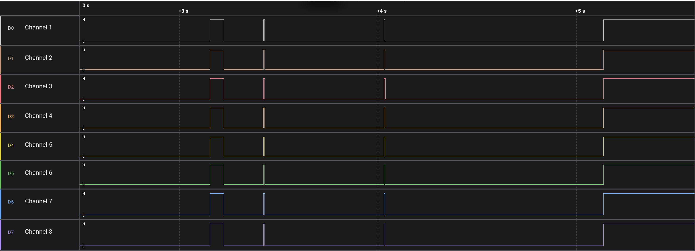
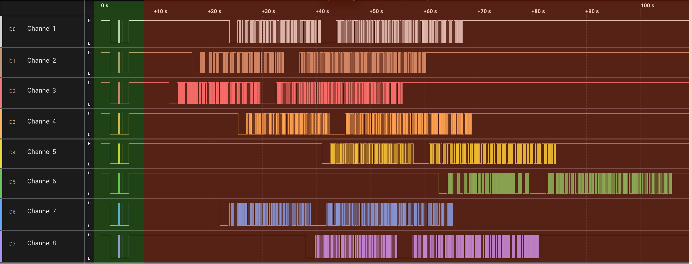

# BIST TestFramework

A robust testing framework (BIST) designed for mcus systems, featuring precise handshake protocols, hardware abstraction, and comprehensive self-tests.

## Core Components

  * **Initial Handshake:** Parallel Time-Division Handshake for synchronization.
  * **Data Handshake:** Reliable data transfer protocol.
  * **Mutex Handler:** Resource management.
  * **Selftests:** Built-in integrity checks (Strength & Connection Analysis).


## GPIO Based Testroutines for External Circuits

The core logic for the analysis algorithms is implemented in `gpio_based_analysis.c`. These routines are designed to test the external circuits connected to the MCU pins.

The framework includes two primary categories of tests. Both support pin masking (`blacklist_mask`) to exclude specific pins from testing.

### 1\. Strength Analysis (Steps 1-3)

Performs electrical strength and drive capability checks.


### 2\. Connection Analysis (Phases 0-5)

Analyzes inter-pin connections to detect shorts or open circuits by iterating through various pull-up/pull-down and driving states.

### Configuration Parameters

The behavior of these tests is controlled by the following constants:

**General Sampling & Timing**

```c
MAX_STACK_SAMPLES = 30;
TIME_BETWEEN_PHASES = 5;
NUMBER_OF_SAMPLES_FOR_DEBOUNCING = 11;
NUMBER_OF_SAMPLES_FOR_MEASURING = 10;
DEBOUNCING_DELAY_US = 10;
```

**Strength Analysis Configuration (Steps 1-3)**

```c
/* Repetitions per step */
repetitions_step1 = 10;
repetitions_step2 = 10;
repetitions_step3 = 10;

/* Samples per step */
number_of_samples_step1 = 12;
number_of_samples_step2 = 12;
number_of_samples_step3 = 12;

/* Settle delays */
sample_delay_step1 = 10;
sample_delay_step2 = 10;
sample_delay_step3 = 10;
```

**Connection Analysis Configuration (Phases 0-5)**

```c
SAMPLES_BEFORE_CHANGING_PIN = 3;
SAMPLES_AFTER_CHANGING_PIN = 9;
DRIVE_SETTLE_TIME_US = 1000;

/* Settle delays per phase */
sample_delay_phase0 = 10;
sample_delay_phase1 = 10;
sample_delay_phase2 = 10;
sample_delay_phase3 = 10;
sample_delay_phase4 = 10;
sample_delay_phase5 = 10;
```

-----

## Handshake Protocols

The core logic for connection establishment is located in `handshake.c`, while data transfer logic is handled in `data_handshake.c`.

### 1\. Initial Handshake (Parallel Time-Division)

The framework uses a 3-way handshake mechanism (SYN, SYN-ACK, ACK) distinguished by specific signal durations in cycles.

**Timing Definitions:**
The protocol identifies the state based on the duration of the signal pulses defined in `handshake.c`:

```c
SYN_DURATION = 200;     // Duration of SYN signal in cycles
SYN_ACK_DURATION = 600; // Duration of SYN_ACK signal in cycles
ACK_DURATION = 1100;    // Duration of ACK signal in cycles
```
The following diagram illustrates the initial handshake:

### 2\. Data Handshake

Once synchronization is established, the data handshake handles the transmission. The visualization below shows the transition from the initial handshake to the data handshake.

**Configurable Parameters (`data_handshake.c`):**
The following constants define the retries, timeouts, and fundamental cycle durations for requests and answers:

```c
/* Logic Control */
MAXIMUM_NUMBER_OF_HANDSHAKE_ATTEMPTS = 3; 
REQUEST_RENEWAL_CYCLES = 50;
MAXIMUM_REQUEST_CYCLES = 400;

/* Base Timings */
INITIAL_LOW_TIME_REQUEST_CYCLES = 10;
INITIAL_LOW_TIME_ANSWER_CYCLES = 20;
```
The diagram below shows the transition from the initial handshake into the data handshake phase.
The green segment in the visualization highlights the time window used by the data handshake:



## HAL (Hardware Abstraction Layer)

### Supported MCUs
  
  * **NRF52840**
  * **MSP430FR5994**

### Functions

  * **GPIO:** Basic GPIO Controll for Open-Drain etc.
  * **Timer:** Usage of the Timer Peripherals
  * **UART Peripheral:** Usage of the UART peripherals
  * **UTILS:** Random Number Generation (RNG) and UUID fetching.

### Known Bugs:
- Data Handshake is limited to 8 Pins
- UART Library on MPS430 has bugs 